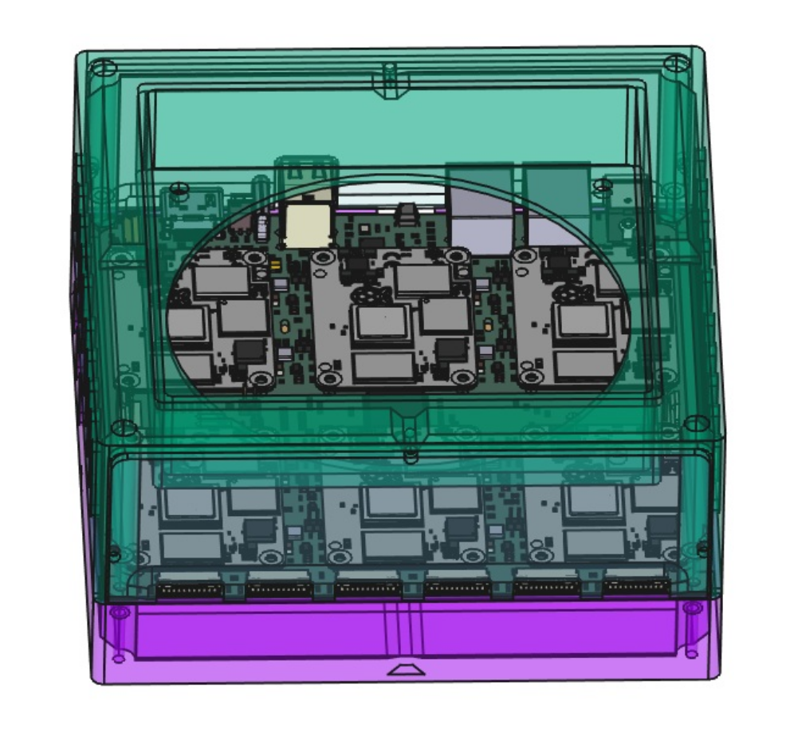
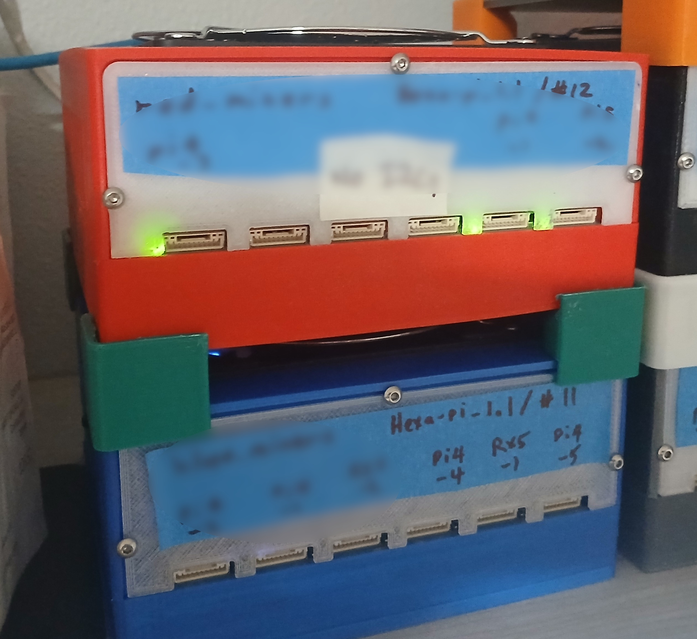

# Hexa-Pi
A Case for the Hexa-Pi board.

Cases Stacked:

This is a fairly simple case for the Hexa-Pi board.
It consists of 4 parts:
- A bottom
- A top - with the PCB connector ends fully exposed
- A Front Panel - this has cutouts for the 6 external connectors
  It is recommended to make this out of semitransparent material so the
  LEDS are readily visible
- A Back Panel - This has cutouts for the power, ethernet, USB and HDMI connectors.
  It is recommended to make this out of semi-transparent material so the
  LEDS are readily visible

In addition, there is a small standOff. 4 of these can be used for stacking.

For good airflow, a 120MM fan is inset on the top, and ventilation slots are on the sides.
The top fan location makes the case larger but provides good airflow without alot of sound,
and allows stacking of Hexa-Pi's. 
120MM fans can be run at around 1/2 speed, and still provide adequate cooling.

Additional hardware needed to assemble 1 board and case:
- 6 M3 heatset fittings. These are heat-set into the bottom - 2 near the center to
  hold the PCB from flexing, and 4 on the corners to secure the top.
- 6 10MM M3 bolts - 2 to hold the PCB, and 4 to secure the case top to the PCB and bottom
  Hex head bolts rather than Phillips head is preferred, since they are deeply inset.
  The 4 corners are difficult to access due to being deeply inset - SORRY!
- 6 4MM M3 bolts or tapered screws to hold the front and back panels on.
  These interfere with, and must be installed after (and removed before) the M3 corner bolts.
- A 120MM X 120MM fan with a 4 pin PWM connector.
  A fan which includes a finger guard/screen is recommended for safety.
  If the fan has a long lead, either wrap it around the fan side or zip-tie to the case.
- M5 bolts are usually provided with fans to hold the fan in place.
  Insert these bolts from inside the case and thread into the fan housing before assembling the case.

The long, deeply inset corner screws are very clumbsy to work with.
They make the case time consuming to assemble and dis-assemble.
Also the attachment of the front and back panels could be greatly improved.
**I would love some sort of snap on case, but my mechanical CAD skills are not there yet!**
**HINT, HINT!**

This work is licensed under the Creative Commons Attribution 4.0 International License. To view a copy of the license, visit https://creativecommons.org/licenses/by/4.0/
