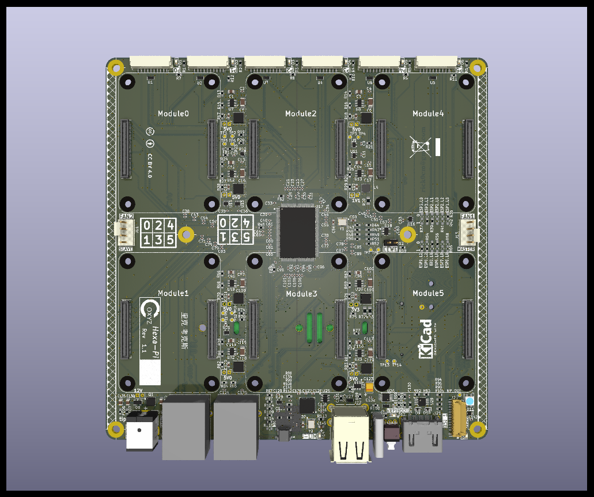
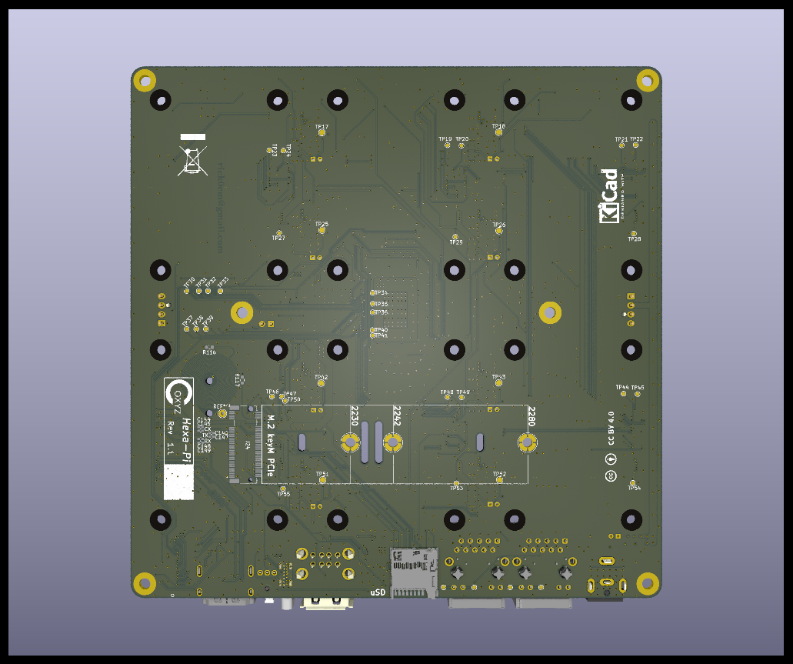

# Hexa-Pi_PCB
A Compact 6 Compute Module Cluster PCB

Here are some views of the PCB.
More are available in the  folder.

Top view of PCB
.

Bottom view of PCB
.

Dimensions of PCB
.
Note that the PCB is 1.6MM thick.

The PCB is intended to be mounted with the top and bottom edges exposed, since there are used connectors and LEDS there.
Along the top edge are the 6 External Conectors, and 6 Activity LEDS for each Module.

Along the bottom - left to right are:
- Power in - nominally 12V. This is a standard size 5.5X2.5MM DC Barrel jack - Center positive.
  This voltage is used directly for the fan, so a 12V fan is required.
  If the fan is not considered, the on board power regulators should work with from 8V to 15V.
- Red Power on LED.  12V is on the board.
- 2 ethernet jacks. These are attached to the on-board switch, so may be used independently.
- A reset switch. Resets everything - all Compute modules and the switch.
- On the bottom is a microSD card slot. This is attached to Compute Module 5.
  On a Raspberry Pi Compute Module, this is only usable on Lite CM's - those without EMMC.
- Yellow USB (and HDMI) overcurrent alert.  This lights up if the current limiter kicks on.
- Dual USB-A ports.  These are attached to Compute Module 5.
- USB-C connector.  This is used when accessing the CM5's EMMC in rpiBoot mode.
- rpiBoot switch and White LED.  Push the locking switch before booting into rpiBoot mode.
  Push again to release into normal mode.
  The LED is on to confirm the locking switch is activated.
- Full sized HDMI connector.  Attached to Compute Module 5.
- Standard Raspberry Pi DSI Display connector.
- Blue PCIe DISK activity LED.
- Behind the DISK LED is a neoPixel connected to CM5 GPIO 18.

At the right center is the Master fan connector - Fan1.
This should be used first is multiple fans are used.
At the left center is the Slave fan connector - Fan2.
Both fan connectors are standard 4 pin PWM fan connectors.
A 1 fan EMC2301 fan controller drives both fan connectors.
The "tach" from Fan1 can be used by the fan controller to send PWM signals to both fans,
so basically both fans should run at the same PWM controlled speed.

A **WARNING** note on the fans. The EMC2301 fan controller has shown it is **very**
sensitive to emc, so **never** plug or unplug fans while the board is powered.
Numerous fan controllers had to be replaced during Hexa-Pi board testing discovering this limitation!

Also on the bottom, not on the board edge, is ain M.2 "Key M" slot for an NVMe.
2230, 2242, and 2280 sized M.2 cards are supported.
A soldered or bolted holddown is required at the appropriate location.
Use **caution** - there is the possibility of interference with 2 of te messanine
connectors on the top side of some holddowns.

There are 6 M3 mounting holes - 2 near the center, and 4 at the corners.

The 6 Compute Module sites are marked. 
The Module numbering is consistent between the actual board mounting locations and the 
Activity LED/External connectors at the top. (Module 0 -> P0, Module 1 -> P1, etc..)
Note that the Mezzanine connectors are **not** symmetric, so the CM orientation matters.
Some of the non-Raspberry Pi modules have an extra 3rd messanine connector.
Watch out for interference in this case.  
There should be enough vertical clearance to handle this - but **verify** before powering on.
M2.5 CM holdown mounting holes are provided, but should not needed for most cases.

Power Consumption TBD

This work is licensed under the Creative Commons Attribution 4.0 International License. To view a copy of the license, visit https://creativecommons.org/licenses/by/4.0/
