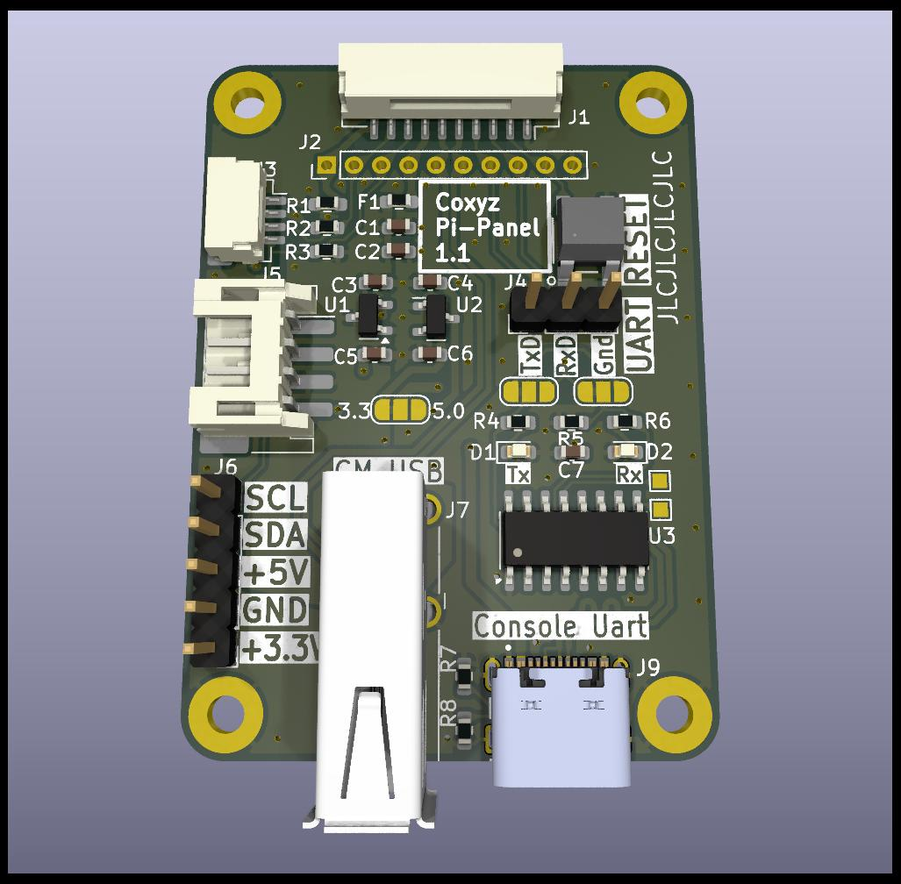

# Hexa-Pi
A small "Front Panel" for the compute modules in the Hexa-Pi PCB.
5 of the modules have mo other peripherals other than ethernet.

This is a small 36mm X 50mm PCB based that connects to the main Hexa-Pi board
using a 10 wire interface with JST connectors.

Since the individual Compute Modules on the main PCB are all powered together,
the goal with this board is to allow some basic repair and diagnosis if here are errors 
or failures on specific modules - without powering the main board down and disassembling the case!

The Activity LED for each module is adjacent and to the left of that board's conncetor.
The panel provides for each module individually:
- 5V, and Gnd. Realistically about 500ma MAX.
  Warning this is NOT current limited. 
  If you overload it, you will crash that Compute Module
- A Reset Push-Button
- A serial console and CH340C USB to serial converter.
  You can directly plug into the USB-C conector and see a serial port.
  This iconnection uses the Raspberry 4 Compute Module serial interface pins -
  GPIO 14 (RxD) and GPIO 15(RxD). Some of the non-Raspberry Pi
  Compute modules default to different Serial console ports&pins
- A USB 2.0 port. This may be used to add any peripheral to the Pi.
  A USB Flash drive is the obvious usage, but anything should work.
- An i2C port. This can be used for whatever desired.  
  I initially envisioned some sort of external display and maybe a couple
  buttons to control it.  I have not developed anything here though, but
  there may be some intersting off-the-shelf options out there.
  The I2C is available on 3 connectors:
  (1) A QWIIC Connector.
  (2) A Stemma-QT Style connector.
  (3) 0.1 inch headers.  Included is a 3.3V supply, which may be useful.

This was developed in KiCad, and the design files are here.
The initial PCB's were built by JLCPCB, and partially assembled by them.
The through-hole parts and I2C connectors were hand assembled.

This PCB was small enough, that a panel of 2 was actually build.
Directory ==production== has the 1 instance manufacturing data, and
directory ==production-pnl== has the 2 instance manufacturing data.
At JLCPCB, both cost the same. 
The assembled 2 instance panel costs a bit more due
to the incremental cost of the parts - but you get 2 for the price of 1!

This work is licensed under the Creative Commons Attribution 4.0 International License. To view a copy of the license, visit https://creativecommons.org/licenses/by/4.0/
