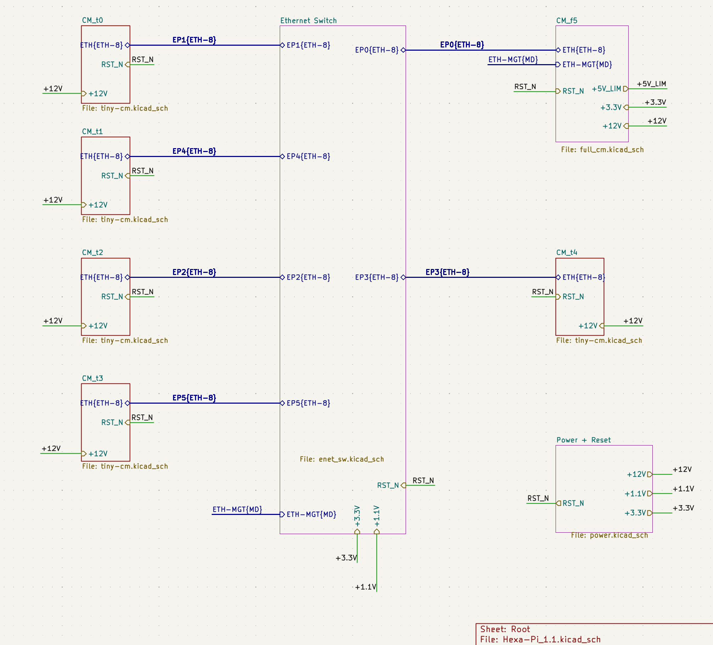
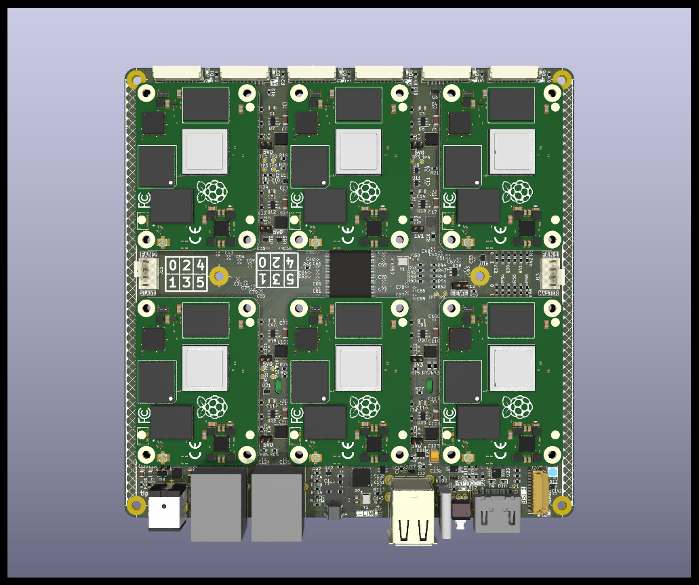

# Hexa-Pi
A Compact 6 Compute Module Cluster

This is a PCB based project to create a very compact cluster of
Raspberry Pi CM4 compatible compute module boards.  It is quite bare-bones
in terms of peripheral support.  One of the modules - Module 5 - has a basic set of peripherals.
The other Modules - 0-4 - have only a small external connector for all I/O.
All 6 modules attach to a 1Gbit ethernet switch IC, which also has 2 off-board connectors.
The entire board - 6 compute modules, switch, and misc functions are powered off of
a single 12V barrel Jack. 

The PCB is 150mm X 150mm.  

Also, there is a small "Pi-Panel" board that attaches to the external connectors 
at the top to provide a few simple peripherals for all of the Modules separately: 
A Green Activity LED is visible at the top, next to each module's connector.

There are also a Red power LED, a Yellow USB Overload LED, a White rpibboot mode LED, and a Blue NVME activity LED,
all on the main PCB, bottom edge as shown here.

Also included is a 3d printable case for the Hexa-Pi board.
The PCB's were built, and mostly assembled, by JLCPCB.
The Case was 3d Printed. 

There is more information in the sub-directories.

